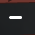
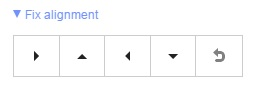
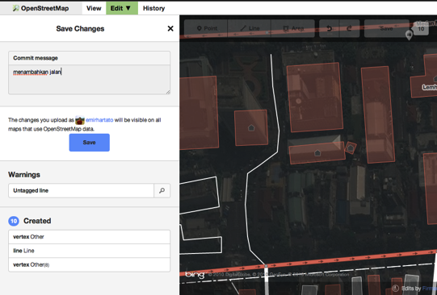

El Editor iD
=============

El editor iD es el editor de OpenStreetMap de facto, basado en navegador. iD es fácil y rápido de utilizar, y permite mapear desde diferentes fuentes de datos como imágenes de satélite y aéreas, GPS, Field Papers o Mapillary.

Usar el editor iD es una buena manera de realizar cambios pequeños y sencillos que no requieren de las características avanzadas de JOSM (un editor de mapas más avanzado). Este capítulo muestra los conceptos básicos de la edición con iD. 

Comenzando con el Editor iD
---------------------------
- El editor iD requiere una conexión activa a Internet.
- Abra su navegador de Internet y vaya a la página web de OpenStreetMap en `http://www.openstreetmap.org <http://www.openstreetmap.org>`_.
- **Iniciar Sesión** usando su cuenta de OpenStreetMap
- Desplace y amplié el área en el mapa que desea editar. Puede desplazar el mapa manteniendo pulsado el botón izquierdo del ratón y arrastrando el mapa al área deseada.  
- Haga clic en la flecha pequeña junto a **Editar**. Luego, haga clic en **Editar con iD (editor en el navegador)**.

.. image:: _static/id-editor_image1_1.png
   :width: 600px
   :alt: id-editor_image1

Interfaz de usuario de iD
-------------------------
.. image:: _static/id-editor_image2.png
   :width: 600px
   :alt: id-editor_image2

1. **Panel de edición de elementos:** Este panel muestra las etiquetas del objeto que ha sido seleccionado en el mapa.

  Puede agregar o editar las etiquetas desde este panel. 

2. **Herramientas:** Este panel muestras las herramientas básicas de edición: 

- Dibujar un punto (nodo), *acceso directo* **1**  
  
.. image:: _static/id-editor_image3.png
   :alt: id-editor_image3

- Dibujar una línea (camino), *acceso directo* **2**  
  
.. image:: _static/id-editor_image4.png
   :alt: id-editor_image4

- Dibujar una forma (polígono), *acceso directo* **3**  

.. image:: _static/id-editor_image5.png
   :alt: id-editor_image5

- Deshacer, *acceso directo* **Ctrl+z**   
  
.. image:: _static/id-editor_image6.png
   :alt: id-editor_image6

- Rehacer, *acceso directo* **Ctrl+y**   
  

- Guardar cambios, *acceso directo* **Ctrl+s**   
  
.. image:: _static/id-editor_image8.png
   :alt: id-editor_image8

3. **Panel del mapa:** Este panel muestra varias funciones de configuración:
    - Acercar, *acceso directo* **+**   
  
.. image:: _static/id-editor_image9.png
   :alt: id-editor_image9

- Alejar, *acceso directo* **-**   
  

- Mostrar su ubicación
  
.. image:: _static/id-editor_image11.png
   :alt: id-editor_image11

- Configurar la capa de fondo, *acceso directo* **b**   
  
.. image:: _static/id-editor_image12.png
   :alt: id-editor_image12

- Datos del mapa, *acceso directo* **f**   

  
- Abrir el menú de ayuda, *acceso directo* **h**   
  
.. image:: _static/id-editor_image13.png
   :alt: id-editor_image13

4. **Panel de información:** Este panel muestra información diversa como, la barra de escala y qué usuarios han contribuido en esa área. 

Configurando la capa de fondo
-----------------------------
Antes de comenzar a editar, puede cambiar la capa de fondo.

- Haga clic en el botón de **Configuración del fondo** o utiliza el *acceso directo* **b**.

.. image:: _static/id-editor_image14.png
   :alt: id-editor_image14

- Verá un panel como este:

 
- Puede cambiar el **nivel de brillo** haciendo clic en alguno de estos cuadros:

.. image:: _static/id-editor_image16.png
   :alt: id-editor_image16

- Hay 4 niveles diferentes de brillo - 100%, 75%, 50% y 25%. Haga clic en cada uno de ellos para ver la diferencia.
- También puede **cambiar la capa de fondo** para usar su proveedor de teselas deseado
  (el predeterminado es Bing Aerial Imagery). Pruebe las diferentes opciones disponibles de esta lista.
- Puede agregar sus propias teselas haciendo clic en **Personalizado**.
- Por ejemplo, si quiere **añadir un Field Paper**, haga clic en **Personalizado** y luego en el icono de la lupa (búsqueda) para abrir la siguiente ventana:  

.. image:: _static/id-editor_image17.png
   :alt: id-editor_image17

e introduzca su **URL de instantánea Field Paper**, que será algo como esto: <http://fieldpapers.org/snapshot.php?id=cqhmf2v9#18/37.80593/-122.22715>  

- Puede **mostrar rutas de GPS desde su computadora** (formato GPX). Es tan simple como arrastrar y soltar el archivo GPX en el editor iD.
- Puede habilitar **trazas GPS de OpenStreetMap** para mostrar trazas públicas de GPS disponibles para el área. En la imagen de abajo, las trazas GPS públicas se muestran en varios colores, lo que indica la dirección de desplazamiento.

.. image:: _static/id-editor_gps_public.png
   :alt: id-editor_gps_public.png

- Si hay que [compensar las imágenes](/es/josm/aerial-imagery), puede **corregir el desfase de imágenes** haciendo clic en corregir la alineación.

- Haga clic en los botones de navegación para mover la imagen. Haga clic en el botón de restaurar para volver a la posición predeterminada.  

.. image:: _static/id-editor_image20.png
   :alt: id-editor_image20

Edición básica con iD
---------------------
Ahora empecemos a practicar con iD.

### Añadiendo puntos
- Para añadir un punto nuevo, haga clic en el botón **Punto**.

.. image:: _static/id-editor_image3.png
   :alt: id-editor_image3

- El cursor de su ratón se transformará en el signo más (+). Ahora, haga clic en una posición que usted conoce para marcar una ubicación. Por ejemplo, si sabe que hay un hospital en su área, haga clic en la posición del mismo.

.. image:: _static/id-editor_image21.png
   :alt: id-editor_image21

- Note que un nuevo punto se ha añadido. Al mismo tiempo, en el panel izquierdo aparecerá un formulario donde puede seleccionar atributos para el objeto. Haga clic en **Hospital** para etiquetar el punto como un hospital.

.. image:: _static/id-editor_image22.png
   :alt: id-editor_image22

- Puede usar los formularios para llenar información detallada acerca del punto. Puede rellenar el nombre del hospital, dirección, y otra información adicional. Note que cada elemento tendrá diferentes opciones, dependiendo de la etiqueta que seleccione del panel de elementos. 
- Si comete un error, como por ejemplo una ubicación incorrecta, puede mover su punto a una nueva ubicación haciendo clic con el botón izquierdo del ratón sobre el punto y arrastrándolo. O, si desea eliminar su punto, haga clic con el botón izquierdo sobre el punto y luego haga clic en el botón que se parece a una papelera.

.. image:: _static/id-editor_image23.png
   :alt: id-editor_image23

Un "punto" creado en el editor iD es en realidad un "nodo" independiente, asociado a un conjunto de "etiquetas".

### Dibujando líneas
- Para agregar una nueva línea, haga clic en el botón **Línea**.

.. image:: _static/id-editor_image4.png
   :alt: id-editor_image4

- Su cursor se transformará en el signo más (+). Busque una ruta que no haya sido dibujada en el mapa y trácela. Haga un sólo clic en el punto donde el segmento de ruta comienza, mueva el ratón, y haga clic nuevamente para agregar puntos adicionales. Haga doble-clic para terminar el proceso de trazado. Observe el panel de la izquierda.

.. image:: _static/id-editor_image24.png
   :alt: id-editor_image24

- Del mismo modo que con un punto, seleccione las etiquetas apropiadas para su línea.
- Puede arrastrar puntos desde la línea haciendo clic con el botón izquierdo del ratón y arrastrándolo.
- También puede mover la línea entera seleccionándola, y eligiendo la **Herramienta de movimiento**. Luego, arrastre la línea hacia su nueva posición.

.. image:: _static/id-editor_image30.png
   :alt: id-editor_image30

- Cuando haga clic con el botón izquierdo del ratón en un punto individual (nodo) de la línea, verá estas herramientas: 

- Eliminar punto de la línea

.. image:: _static/id-editor_image23.png
   :alt: id-editor_image23

- Desconectar punto de la línea

.. image:: _static/id-editor_image26.png
   :alt: id-editor_image26

- Dividir la línea en dos a partir del punto seleccionado

.. image:: _static/id-editor_image27.png
   :alt: id-editor_image27

- Cuando haga clic con el botón izquierdo del ratón en una línea (pero no en un punto), verá estas herramientas:

- Eliminar línea

.. image:: _static/id-editor_image23.png
   :alt: id-editor_image23

- Crear un círculo  a partir de una línea (activo solamente si la línea es cerrada)

.. image:: _static/id-editor_image29.png
   :alt: id-editor_image29

- Mover línea

.. image:: _static/id-editor_image30.png
   :alt: id-editor_image30

- Formar una figura cuadrada a partir de una línea (activo solamente si la línea es cerrada)

- Invertir la dirección de la línea (útil para ríos y calles de un solo sentido)

.. image:: _static/id-editor_image32.png
   :alt: id-editor_image32

Una "línea" creada en el editor iD es en realidad una "vía" con "etiquetas" asociadas.

>Una consideración con respecto a la **Eliminación**: En general, debería evitar eliminar mapeos de otras personas si solo necesitan mejoras. Puede borrar sus propios errores, pero debería intentar *corregir* los objetos mapeados de otras personas si es que necesitan cambios. Esto preserva la historia de los elementos en la base de datos de OSM y es respetuoso hacia otros mapeadores. Si realmente cree que algo debería ser eliminado, considere primero consultarlo con el mapeador original, o en alguna de las listas de correo de OSM.

### Dibujando formas (polígonos)
- Para añadir un nuevo polígono, haga clic en el botón **Área**.

.. image:: _static/id-editor_image34.png
   :alt: id-editor_image34

- Su cursor se transformará en el signo más (+). Intente trazar un edificio usando la imagen como guía.
- Notará que el color del polígono cambiará dependiendo de los atributos que le asigne al mismo.

.. image:: _static/id-editor_image35.png
   :alt: id-editor_image35

- Las herramientas que están disponibles cuando selecciona un polígono son similares a aquellas que están disponibles cuando hace clic en una línea.

Un "polígono" en el editor iD es en realidad una "vía cerrada" con etiquetas asociadas.

Guardando sus cambios
---------------------
- Cuando desee guardar sus cambios en OpenStreetMap (si es que así lo desea), haga clic en el botón
  **Guardar**. El panel de la izquierda mostrará el panel de subida.

- Ingrese un comentario acerca de sus cambios y haga clic en **Guardar**.

Información adicional y etiquetas personalizadas
------------------------------------------------
- Cuando esté editando un objeto, verá una tira de iconos en la sección inferior del panel de atributos. Puede agregar información adicional haciendo clic en estos iconos:

- Añadir elevación

.. image:: _static/id-editor_image37.png
   :alt: id-editor_image37
  
- Añadir notas
  
.. image:: _static/id-editor_image38.png
   :alt: id-editor_image38
  
- Añadir contactos / número de teléfono
  
.. image:: _static/id-editor_image39.png
   :alt: id-editor_image39
  
- Añadir etiqueta de origen
  
.. image:: _static/id-editor_image40.png
   :alt: id-editor_image40
  
- Añadir sitio web
  
.. image:: _static/id-editor_image41.png
   :alt: id-editor_image41
  
- Añadir información de accesibilidad
  
.. image:: _static/id-editor_image42.png
   :alt: id-editor_image42
  
- Añadir enlace de Wikipedia
  
.. image:: _static/id-editor_image43.png
   :alt: id-editor_image43

- O, puede añadir etiquetas personalizadas haciendo clic en **Todas las etiquetas**.

.. image:: _static/id-editor_image44.png
   :alt: id-editor_image44

- Esto mostrará todas las etiquetas asociadas al elemento.

- Haga clic en el signo más (+) para añadir claves y valores, o haga clic en el icono de la papelera para eliminar etiquetas.

iD versus JOSM
---------------
iD es bueno para... 

- Cuando esté realizando cambios simples  
- Cuando tiene Internet lo suficientemente rápida para cargar las imágenes y guardar los cambios  
- Cuando quiere estar seguro de seguir un esquema de etiquetado simple y consistente  
- Cuando no tenga la libertad de instalar un programa en la computadora que esté usando

JOSM es mejor... 

- Cuando esté añadiendo muchos edificios (refiérase al plugin buildings_tool)
- Cuando esté editando muchos polígonos o líneas que ya existen
- Cuando no tenga una conexión a Internet confiable o esté fuera de línea
- Cuando utilice un esquema de etiquetado específico (o preajustes personalizados)

