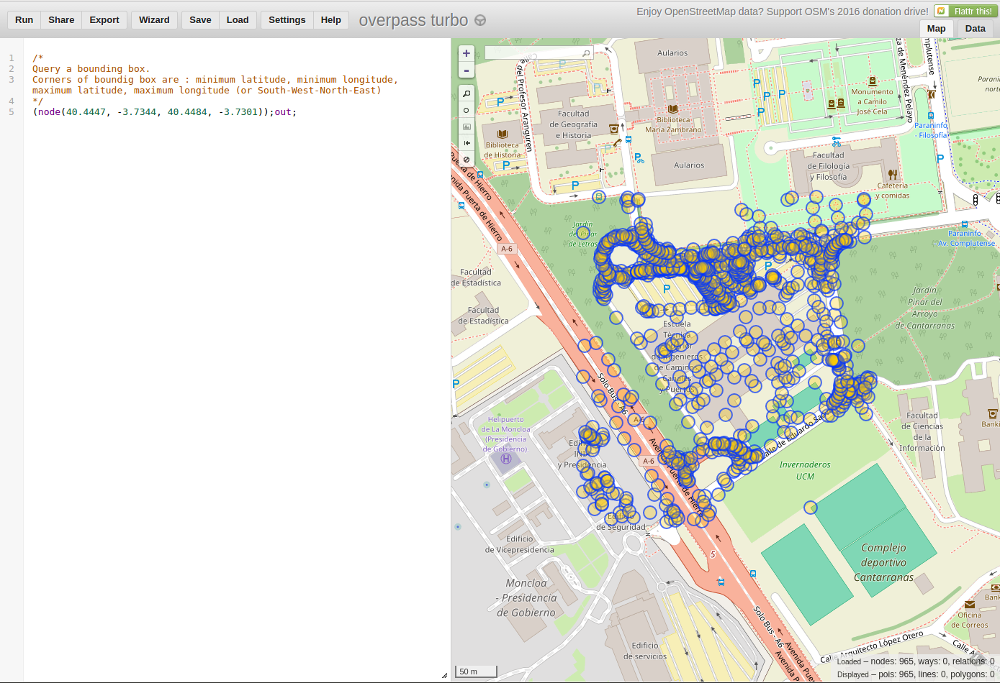
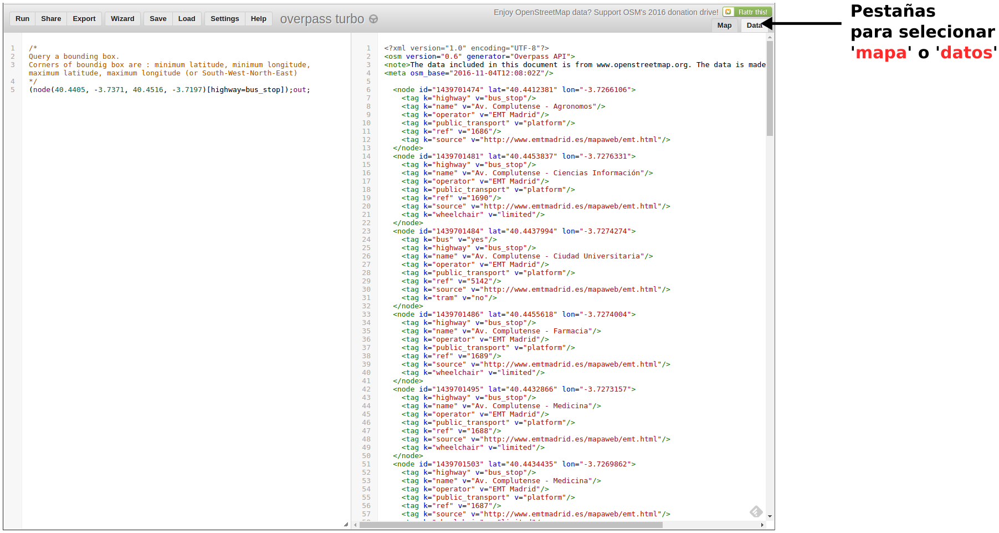

.. Overpass API

Overpass API
============

Introducción
------------

Overpass API permite hacer consultas a la base de datos de OSM según distintos criterios de búsqueda. El criterio de búsqueda puede ser, entre otros, la localización de los elementos, el tipo de los mismos, que contengan determinadas etiquetas o combinaciones de varios criterios. Actua a modo de base de datos en la red: el cliente envía una petición (query) y obtiene como resultado el conjunto de datos que se corresponde con dicha petición. Los resultados de las consultas se pueden obtener en los formatos OSM XML y en OSM JSON. 

El wiki de OpenStreetMap ofrece una página quepuede servir de introducción a las principales características de la API de Overpass en la siguiente dirección:

 `http://wiki.openstreetmap.org/wiki/Overpass_API <http://wiki.openstreetmap.org/wiki/Overpass_API>`_

El portal de Overpass-API, por su parte, ofrece la información completa acerca del API, su lenguaje de consultas y otras herramientas que se ponen a disposición. La dirección del portal de Overpass API es: 

  `http://overpass-api.de/index.html <http://overpass-api.de/index.html>`_

Overpass API tiene su propio lenguaje. En este curso haremos una introducción a dicho lenguaje y aprenderemos cómo hacer algunas consultas básicas. Se puede encontrar una descripción más detallada de las especificaciones del lenguaje en las siguientes direcciones WEB:

 `http://wiki.openstreetmap.org/wiki/Overpass_API/Language_Guide <http://wiki.openstreetmap.org/wiki/Overpass_API/Language_Guide>`_

 `http://wiki.openstreetmap.org/wiki/Overpass_API/Overpass_QL <http://wiki.openstreetmap.org/wiki/Overpass_API/Overpass_QL>`_

En este curso también daremos una explicación del funcionamiento y posibilidades del portal Overpass Turbo. El portal Overpass Turbo se puede utilizar para hacer consultas utilizando Overpass API y obtener las salidas en diferentes formatos. Ofrece varias utilidades relacionadas con la realización de las consultas, como la posibilidad de crear enlaces a las mismas, exportación de los resultados en varios formatos, la posibilidad de hacer consultas en lenguaje natural y otras. Más adelante, explicaremosalgunas de ellas. La dirección del portal de Overpass Turbo es:

 `http://overpass-turbo.eu <http://overpass-turbo.eu>`_

Otro portal interesante para probar o fabricar consultas es el siguiente:
 
 `http://overpass-api.de/query_form.html <http://overpass-api.de/query_form.html>`_. 
 
Una opción interesante de este último portal es la posibilidad de generar un programa OpenLayers con el mapa de OpenStreetMap y la consulta.

Overpass API tiene ciertas limitaciones. Para consultas que consistan en todos los elementos de un área geográfica extensa, es más operativo utilizar los paquetes de datos proporcionados por  `Geofrabik <http://download.geofabrik.de/>`_ u otros distribuidores de datos. Se pueden consultar los distribuidores de datos en:

 `http://wiki.openstreetmap.org/wiki/Processed_data_providers <http://wiki.openstreetmap.org/wiki/Processed_data_providers>`_

Otra limitación de las consultas a través de Overpass API es que no podemos hacer consultas acerca de los *changesets*, esto es, los conjuntos de cambios que han ido afectando a determinados elementos. Sí que podemos haecr la consulta con un criterio de selección temporal que nos indique el estado de un elemento en determinado instante de tiempo.

Peticion de los **node** de una zona
------------------------------------

La petición más sencilla que podemos hacer es, seguramente, la de los elementos del tipo **node** contenidos en un area delimitado por un *boundig box*. Un *bounding* box es una área rectangular del mapa definido por las coordenadas de su esquina inferior izquierda (sur-oeste) y las de su esquina superior derecha (norte-este). El orden en que se escriben las coordenadas es 'latitud mínima, longitud mínima, latitud máxima, longitud máxima'. (**Nota:** *Hay que tener en cuenta que, cuando las longitudes o latitudes son negativas, los valores menores corresponden a valores abslutos mayores, así la longitud -3.98 es *menor* que la longitud -3.8, por ejemplo*). 

Veamos un ejemplo de una query que solicite todos los nodos contenidos en un rectángulo de coordenadas *'40.4447, -3.7344, 40.4484, -3.7301'*. La sentencia o query que tenemos que escribir en el lenguaje QL de Overpass API es la siguiente::

  (node(40.4447, -3.7344, 40.4484, -3.7301));out;

Puedes probar la orden tecleándola en el portal `Overpass Turbo <http://overpass-turbo.eu/>`_ o directamente accediendo al siguiente enlace que se ha obtenido mediante la opción *share* de dicho portal:

 |ejemplo_1|.

.. |ejemplo_1| raw:: html

   <a href="http://overpass-turbo.eu/s/jPd" target="_blank">(node(40.4447, -3.7344, 40.4484, -3.7301));out;</a>

Esta sentencia en realidad son dos órdenes a la API de Overpass: 

+ La primera orden es *(node(minlat, minlon, maxlat, maxlon))*. El bounding box se especifica como: (minLat, minLon, maxLat, maxLon).

+ La segunda orden es *out*

Las dos ordenes se separan por un punto y coma y se ejecutan una a continuación de otra. Podemos enlazar varias ordenes una detrás de otra separándolas por punto y coma. La orden completa funciona a modo '*tubería*'. El resultado de cada orden individual se pasa a la siguiente orden, que operará sobre dicho resultado. En el ejemplo anterior, el resultado de los nodos del bounding box son los que se pasan a la orden *out*, que nos devuelve el conjunto de datos.

Podemos afinar nuestra búsqueda.Para ello vamos a añadir un filtro que seleccione solo los nodos que tengan la etiqueta **highway** con el valor **bus_stop**. Aplicaremos esta orden a un boundig box un poco mayor, que abarque una zona amplia de la Ciudad Universitaria. De esta forma obtendremos todas las paradas de autobús que figuren en el mapa dentro de la zona especificada por el bounding box:

|ejemplo_2|.

.. |ejemplo_2| raw:: html

   <a href="http://overpass-turbo.eu/s/jPD" target="_blank">(node(40.4405, -3.7371, 40.4516, -3.7197)[highway=bus_stop]);out;</a>

El portal *Overpass Turbo* nos ofrece la posibilidad de obtener los resultados dibujando los nodos sobre un mapa o en formato **OSM XML**. Para ello hay que pulsar la pestaña correspondiente en la esquina superior derecha. 

Más adelante veremos como combinar varias etiquetas o como realizar peticiones más complejas. De momento vamos a repasar un poco algunas de las opciones que nos ofrece el portal de *Overpass Turbo*.

Opciones de Overpass Turbo
--------------------------

El portal de *Overpass Turbo* nos ofrece unas cuantas opciones muy interesantes. Se accede a ellas en las pestañas que aparecen en la parte superior de la página. Las opciones principales son las siguientes:

+ **Run**: ejecuta la consulta que esté escrita en el editor y muestra el resultado en la pantalla del mapa. Una vez ejecutada la consulta puede ser necesario pulsar sobre la pequeña lupa que aparece en la parte superior izquierda delmapa para que centre la vista sobre la consulta que se acaba de realizar.

+ **Share**: ofrece un enlace mediante el cual podemos recuperar la consulta mediante un navegador.

+ **Export**: permite guardar en disco el resultado de la consulta en diferentes formatos. También permite guardar el propio mapa, como imagen *png*, o como mapa interactivo. Por último, desde esta opción, también podemos grabar el texto de la propia consulta.

+ **Wizard**: esta opción nos ayuda a crear consultas mediante lenguaje natural, que luego convertirá al lenguaje de Overpass API.

+ **Save**: guarda en el propio navegador una consulta para poder utilizarla en otro momento posterior de la sesión de trabajo.

+ **Load**: recupera una consulta guardada anteriormente mediante el comando *save*

+ **Settings**: permite configurar algunas de las opciones del programa

+ **Help**: ayuda en la que se explican todas las opciones y atajos de teclado del programa. 

+ **Map-Data**: como se explicó en el aprtado anterior, estas pestañas permiten seleccionar que la salida de resultados de una consulta se muestre sobre el mapa o como texto en formato *OSM XML*

El mapa también dispone de algunas opciones de navegación en los botones de la parte superior izquierda.

Ejemplos con Overpass Turbo
---------------------------

Un elemento por su ID
^^^^^^^^^^^^^^^^^^^^^

  node(4129698657);out;

Todos los nodos farmacia de Salamanca
^^^^^^^^^^^^^^^^^^^^^^^^^^^^^^^^^^^^^

  node(40.9365, -5.7087, 40.9942, -5.6586)["amenity"="pharmacy"];out;

Todas los nodos paradas de autobús de la Ciudad Universitaria en Madrid::
^^^^^^^^^^^^^^^^^^^^^^^^^^^^^^^^^^^^^^^^^^^^^^^^^^^^^^^^^^^^^^^^^^^^^^^

  node(40.4405,-3.7404,40.4551,-3.7279)["highway"="bus_stop"];out;

Todos nodos los hospitales de Madrid::
^^^^^^^^^^^^^^^^^^^^^^^^^^^^^^^^^^^^

  node(40.3091,-3.7707,40.5420,-3.5702)["amenity"="hospital"];out;

Todas las ways de Madrid referenciadas en la relación de ref=M-40::
^^^^^^^^^^^^^^^^^^^^^^^^^^^^^^^^^^^^^^^^^^^^^^^^^^^^^^^^^^^^^^^^^

  relation(40.3091,-3.7707,40.5420,-3.5702)["ref"="M-40"];way(r);out;

Ûnión 
^^^^^
Podemos hacer la unión de dos queries poniéndolas entre paréntesis y separadas por ';'. Por ejemplo, la siguiente sentencia solicita los Nodes con 'amenity=restaurant' o 'amenity=pub'::

  (node(41.9837,2.8243,41.9866,2.8307)[amenity=restaurant];node(41.9837,2.8243,41.9866,2.8307)[amenity=pub]);out;

Otro ejemplo: todos los bares o pubs del Barrio de Salamanca en Madrid::

  (node(40.4232,-3.6918,40.4378,-3.6793)["amenity"="bar"];node(40.4232,-3.6918,40.4378,-3.6793)["amenity"="pub"];);out;

Ways con recursividad a nodos para que se vean las líneas: M-607
^^^^^^^^^^^^^^^^^^^^^^^^^^^^^^^^^^^^^^^^^^^^^^^^^^^^^^^^^^^^^^^^

  way(40.6573,-3.9610,40.7169,-3.7423)["ref"="M-607"];(._;>;);out;

Around: Elementos a cierta distancia de uno punto de coordenadas conocidas
^^^^^^^^^^^^^^^^^^^^^^^^^^^^^^^^^^^^^^^^^^^^^^^^^^^^^^^^^^^^^^^^^^^^^^^^^^

También podríamos pedir los Nodes que se encuentran a una determinada distancia de un punto de coordenadas conocidas:

  node(around:100.0,41.9837,2.8243);out;

Around un elemento determinado:

  way(132527765);node(around:500)["amenity"="bar"];out;

Hay multitud de combinaciones que permiten hacer todo tipo de consultas selectivas. Se puede consultar la documentación completa del lenguaje en el siguiente enlace:

`http://wiki.openstreetmap.org/wiki/Overpass_API/Overpass_QL#By_element_id <http://wiki.openstreetmap.org/wiki/Overpass_API/Overpass_QL#By_element_id>`_

Utilización con wget desde Linux
--------------------------------

También podemos utilizar el comando linux *wget* con la siguiente estrutura::

  wget -O file.osm "http://overpass-api.de/api/interpreter?data=sentencia_overpass_api"

Utilización desde lenguajes de programación
-------------------------------------------

Mediante peticiones GET o POST, podemos realizar las consultas desde cualquier lenguaje de programación.

